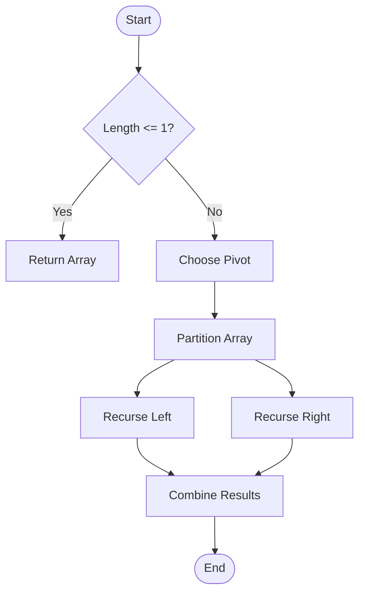

Sorting is a fundamental concept in computer science. Let's look at **QuickSort**.

## Implementation

```typescript
function quickSort(arr: number[]): number[] {
  if (arr.length <= 1) {
    return arr;
  }

  const pivot = arr[arr.length - 1];
  const left = [];
  const right = [];

  for (let i = 0; i < arr.length - 1; i++) {
    if (arr[i] < pivot) {
      left.push(arr[i]);
    } else {
      right.push(arr[i]);
    }
  }

  return [...quickSort(left), pivot, ...quickSort(right)];
}
```

## Logic Flow

