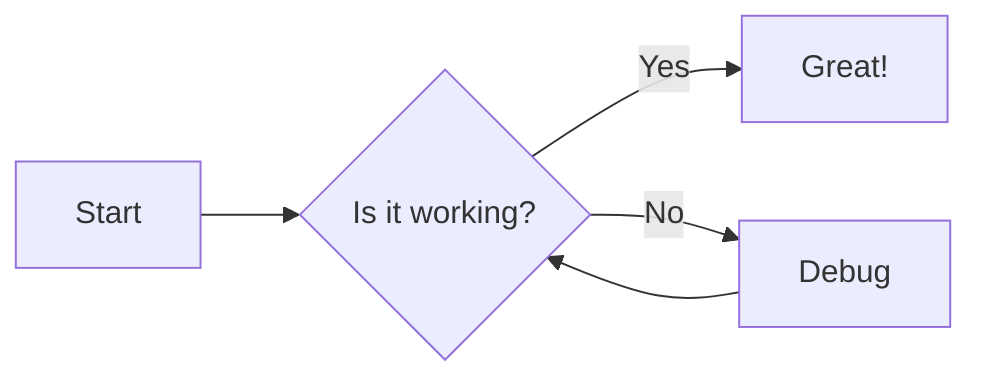
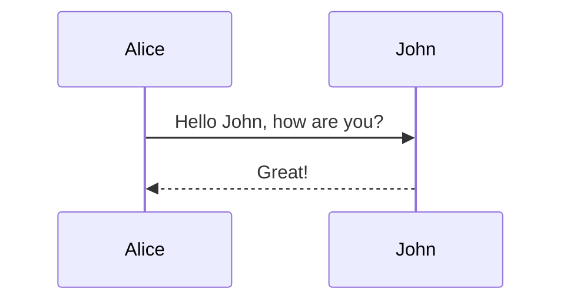

# Heading Level 1

This is a paragraph under H1. **Bold text**, *italic text*, and ~~strikethrough~~.

## Heading Level 2

Here is a blockquote:

> "The digital garden is not just a collection of posts, but a web of interconnected thoughts."
> 
> — Unknown Gardener

### Heading Level 3

#### Heading Level 4

##### Heading Level 5

###### Heading Level 6

---

## Lists

### Unordered
- Item 1
- Item 2
  - Nested Item 2.1
  - Nested Item 2.2
- Item 3

### Ordered
1. Step One
2. Step Two
3. Step Three

### Task List
- [x] Implement Markdown
- [x] Add Syntax Highlighting
- [ ] Write Documentation

---

## Code

### Inline
The `useState` hook is essential. You can install via `bun install`.

### Code Blocks

**TypeScript:**
```typescript
interface User {
  id: number;
  name: string;
}

function getUser(id: number): User {
  return { id, name: "Alice" };
}
```

**Bash:**
```bash
echo "Hello World" > hello.txt
ls -la
```

**JSON:**
```json
{
  "project": "Amytis",
  "version": "1.2.0"
}
```

---

## Math (LaTeX)

Inline math: $E = mc^2$ and $e^{iπ} + 1 = 0$. 

Block math:

$$
\frac{1}{\sigma\sqrt{2\pi}} \exp\left( -\frac{1}{2} \left( \frac{x-\mu}{\sigma} \right)^2 \right)
$$

---

## Diagrams (Mermaid)

### Flowchart


### Sequence Diagram


---

## Images

### Standard Markdown


### Raw HTML (Quoted)


---

## Tables

| Feature | Status | Notes |
| :--- | :---: | :--- |
| **GFM** | ✅ | Tables supported |
| **Math** | ✅ | KaTeX integration |
| **Mermaid** | ✅ | Native rendering |

---

## Links

- [Internal Link to Home](/)
- [External Link (Google)](https://google.com)
- [Reference Link][repo]

[repo]: https://github.com/vercel/next.js

---

## HTML Components

<details>
  <summary>Click to expand secret info</summary>
  <div style="padding: 1rem; background: #f0fdf4; border-radius: 0.5rem; color: #166534;">
    This content is inside a raw HTML <code>details</code> tag with inline styles.
  </div>
</details>

---

## Footnotes

Here is a footnote reference[^1]. And another one[^note2].

[^1]: This is the first footnote text.
[^note2]: This is a second footnote with **bold** text.
