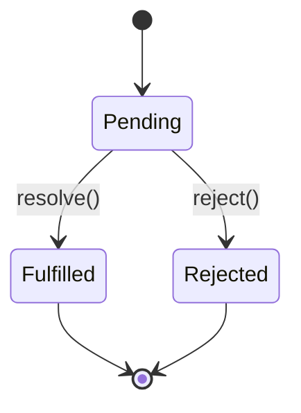

Handling asynchronous operations is critical in JavaScript.

## The Evolution

1. Callbacks (Callback Hell)
2. Promises
3. Async/Await

## Code Comparison

**Using Promises:**

```javascript
fetchData()
  .then(data => process(data))
  .catch(err => console.error(err));
```

**Using Async/Await:**

```javascript
async function getData() {
  try {
    const data = await fetchData();
    return process(data);
  } catch (err) {
    console.error(err);
  }
}
```

## Promise State Machine

