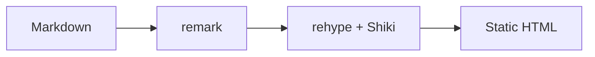

The default Shiki pipeline applies build-time syntax highlighting with a
dual `github-light` / `github-dark` theme. The features below are opt-in
via fence metadata.

## Title bar

```ts title="src/app.ts"
export const greet = (name: string) => `Hello, ${name}!`;
```

## Line numbers

```python linenos
def fib(n):
    if n < 2:
        return n
    return fib(n - 1) + fib(n - 2)
```

## Highlighted lines

```rust {2,4-6}
fn main() {
    let x = compute();
    println!("{x}");
    if x > 10 {
        warn();
        recover();
    }
}
```

## Title + line numbers + highlights combined

```tsx title="components/CodeBlock.tsx" linenos {3,7-9}
import { highlightToHast } from '@/lib/shiki';
import { toHtml } from 'hast-util-to-html';
import CodeBlockToolbar from './CodeBlockToolbar';

export default async function CodeBlock({ language, children, title }) {
  const hast = await highlightToHast(children, language, { title });
  const html = toHtml(hast);
  return (
    <div className="cb-root">
      {title && <span className="cb-title">{title}</span>}
      <CodeBlockToolbar code={children} />
      <div dangerouslySetInnerHTML={{ __html: html }} />
    </div>
  );
}
```

## Diff with red/green backgrounds

```diff
-export const VERSION = "1.0";
+export const VERSION = "2.0";
 export const NAME = "amytis";
-export const STAGE = "alpha";
+export const STAGE = "beta";
```

## Mermaid still works (regression check)



## Explicit plaintext

```plaintext
This block opts out of syntax highlighting entirely. Use `plaintext` (or its
aliases `text`, `txt`, `plain`) for prose-like blocks where token coloring
would be noisy or misleading. Unknown language names will fail the build.
```
