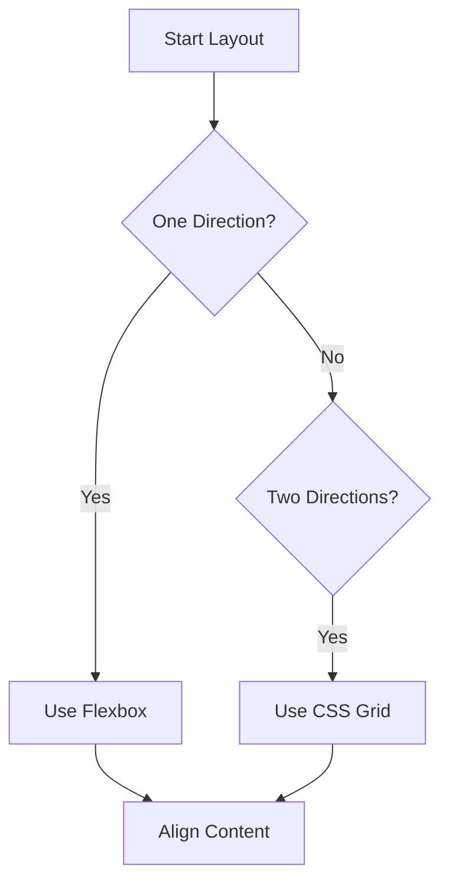

CSS has come a long way. Today we primarily use Grid and Flexbox.

## Flexbox

Best for **1-dimensional** layouts (rows OR columns).

```css
.container {
  display: flex;
  justify-content: center;
  align-items: center;
}
```

## CSS Grid

Best for **2-dimensional** layouts (rows AND columns).

```css
.grid-container {
  display: grid;
  grid-template-columns: repeat(3, 1fr);
  gap: 20px;
}
```

## Decision Tree

