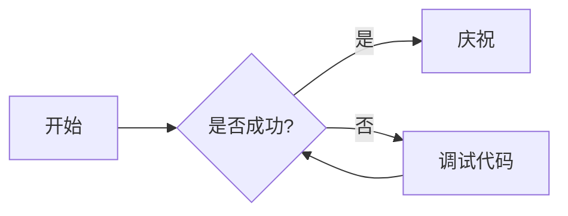

# 欢迎来到数字花园

这是一个结合了 **中文** 和 *English* 的测试页面。我们致力于提供最优质的阅读体验。

## 核心特性 (Core Features)

### 1. 自动生成目录 (TOC)

该部分用于测试中文标题是否能正确生成 ID 并在侧边栏中点击跳转。

### 2. 代码高亮 (Syntax Highlighting)

支持多种编程语言的高亮显示。

```typescript
// 这是一个 TypeScript 示例
function greet(name: string): string {
  return `你好, ${name}! Welcome to Amytis.`;
}
```

```rust
// 这是一个 Rust 示例
fn main() {
    println!("你好，世界！");
}
```

## 复杂图表 (Mermaid)

测试 Mermaid 图表中的中文标签是否正常显示。



## 数学公式 (LaTeX)

支持行内公式 $E=mc^2$ 以及块级公式：

$$
\frac{-b \pm \sqrt{b^2 - 4ac}}{2a}
$$

## 脚注测试

我们可以为某些词汇添加脚注[^1]。

[^1]: 这是一个中文脚注的示例。

## 总结

多语言支持对于数字花园至关重要。

> "语言的边界就是世界的边界。" — 维特根斯坦
