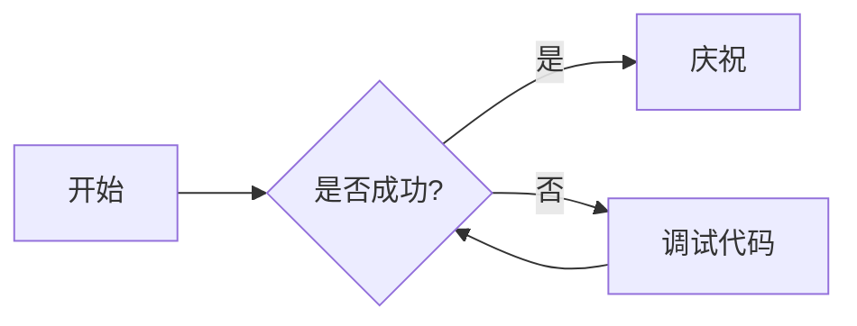

# 欢迎来到数字花园

这是一个结合了 **中文** 和 *English* 的测试页面。我们致力于提供最优质的阅读体验。

## 核心特性 (Core Features)

### 1. 自动生成目录 (TOC)

该部分用于测试中文标题是否能正确生成 ID 并在侧边栏中点击跳转。

### 2. 代码高亮 (Syntax Highlighting)

支持多种编程语言的高亮显示。

```typescript
// 这是一个 TypeScript 示例
function greet(name: string): string {
  return `你好, ${name}! Welcome to Amytis.`;
}
```

```rust
// 这是一个 Rust 示例
fn main() {
    println!("你好，世界！");
}
```

## 深入探讨 (Deep Dive)

### 3. 排版展示 (Typography)

中文排版需要考虑字符间距和行高。在 Tailwind v4 中，我们通过 `prose-emerald` 插件来优化视觉效果。

这是一段较长的中文测试文本：
数字花园不仅仅是一个博客，它是一个不断生长的知识库。在这里，每一个节点都可能触发新的思考。我们支持 **加粗**、*斜体*、~~删除线~~ 以及 `行内代码`。

### 4. 国际化支持 (I18n)

Amytis 旨在支持多种语言的无缝切换（虽然目前主要展示中文支持）。对于 CJK 字符，由于没有空格作为天然的分隔符，目录生成逻辑（slugify）需要特别处理。我们现在使用 `github-slugger` 来确保 ID 生成的一致性。

## 复杂图表 (Mermaid)

测试 Mermaid 图表中的中文标签是否正常显示。



## 技术实现 (Technical Implementation)

### 5. Next.js App Router

我们利用 Next.js 15 的强力特性，如静态生成 (SSG) 和 服务器组件 (Server Components)。

### 6. Tailwind CSS v4

采用最新的 Tailwind CSS v4，利用其高性能的引擎和更简洁的配置。

### 7. 静态站点导出 (Static Export)

由于我们需要将站点部署在 GitHub Pages 或类似的静态托管服务上，我们使用了 `output: 'export'`。

## 数学公式 (LaTeX)

支持行内公式 $E=mc^2$ 以及块级公式：

$$
\frac{-b \pm \sqrt{b^2 - 4ac}}{2a}
$$

## 更多测试章节 (Extended Sections)

### 8. 列表测试 (Lists)

- 无序列表项一 (Unordered Item 1)
- 无序列表项二 (Unordered Item 2)
  - 嵌套项 (Nested Item)
  - 嵌套项二 (Nested Item 2)

1. 有序列表项一 (Ordered Item 1)
2. 有序列表项二 (Ordered Item 2)

### 9. 引用块 (Blockquotes)

> 这是一个带有作者信息的引用块。数字花园的概念最早由 Mike Caulfield 提出，强调知识的非线性和持续演进。

### 10. 脚注测试

我们可以为某些词汇添加脚注[^1]。

[^1]: 这是一个中文脚注的示例。

## 未来展望 (Future Roadmap)

### 11. 搜索功能增强

我们将集成模糊搜索，支持中文分词，提升搜索体验。

### 12. 更多主题色

除了现在的翡翠色 (Emerald)，我们还计划支持琥珀色 (Amber) 和 玫瑰色 (Rose)。

## 总结

多语言支持对于数字花园至关重要。

> "语言的边界就是世界的边界。" — 维特根斯坦