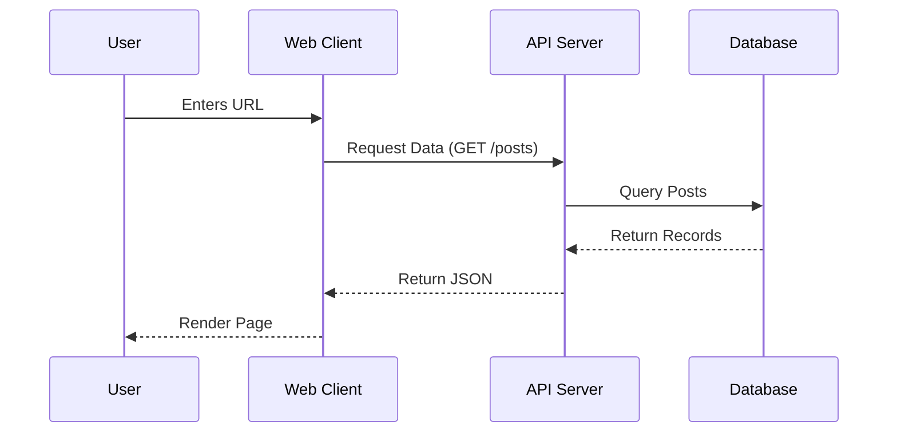

When designing complex systems, visualization is key. Here is a simple 3-tier architecture example.

## 3-Tier Architecture

This pattern separates the presentation, application processing, and data management functions.



## Microservices Configuration

Often, services communicate via a message bus.

```json
{
  "service": "order-service",
  "dependencies": ["inventory", "payment"],
  "eventBus": "kafka"
}
```