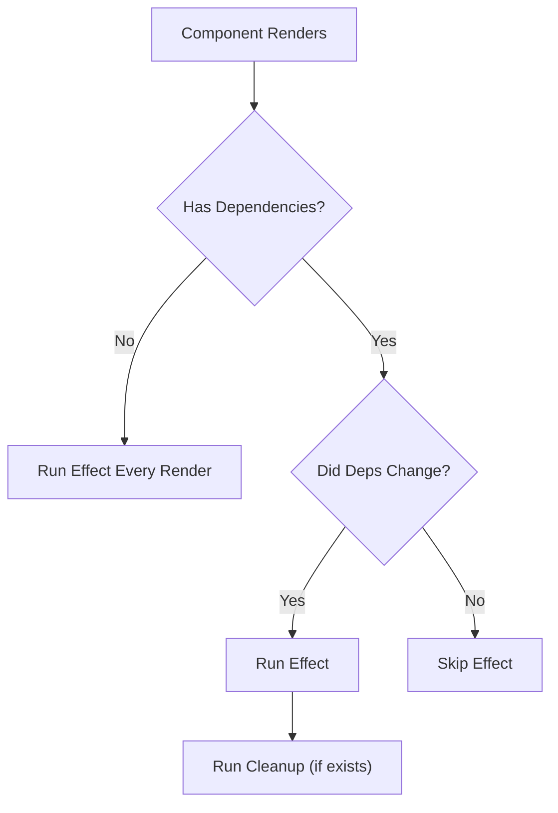

React Hooks revolutionized how we write components. Let's explore the core hooks.

## The State Hook: useState

The `useState` hook allows you to add state to function components.

```tsx
import { useState } from 'react';

function Counter() {
  const [count, setCount] = useState(0);

  return (
    <div>
      <p>You clicked {count} times</p>
      <button onClick={() => setCount(count + 1)}>
        Click me
      </button>
    </div>
  );
}
```

## The Effect Hook: useEffect

`useEffect` handles side effects like data fetching or subscriptions.

### Dependency Array Logic

