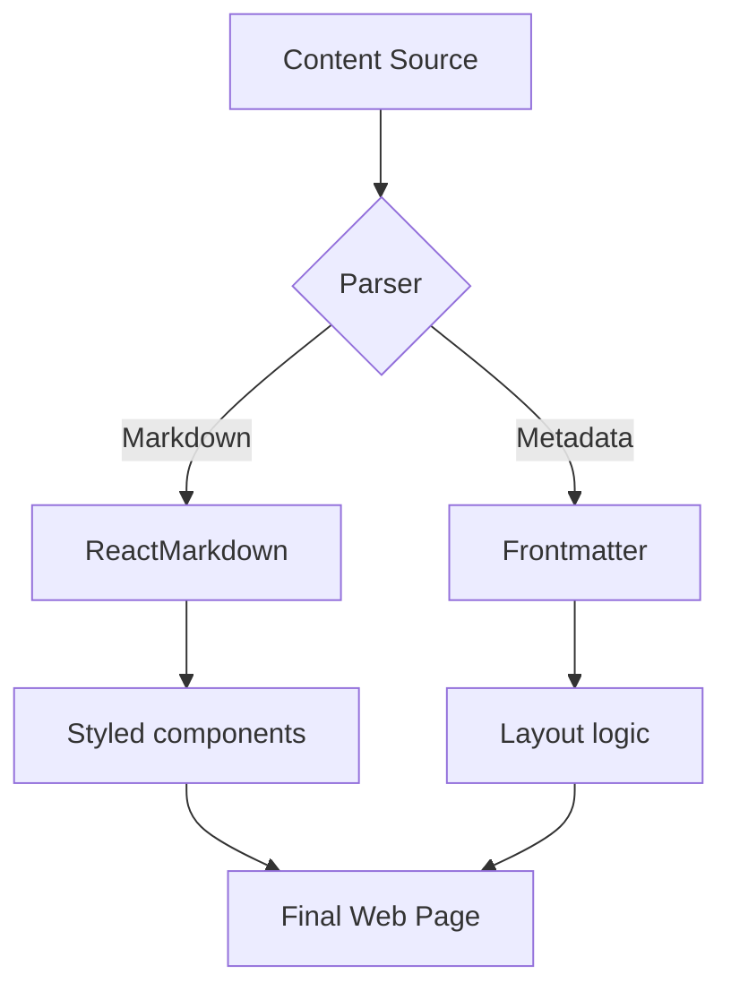

# Rich Content and Multimedia

Welcome back to the **Advanced Markdown Mastery** series. In this second part, we move beyond text structure to explore how we can present data and visuals effectively.

## 1. Complex Tables

Markdown tables are excellent for structured data. We've ensured that wide tables are scrollable on smaller screens.

| Category | Component | Description | Complexity |
| :--- | :--- | :--- | :---: |
| **Logic** | `MarkdownRenderer` | The core engine for parsing and rendering MDX. | High |
| **Nav** | `TableOfContents` | Sticky sidebar providing quick access to headings. | Medium |
| **UI** | `PostCard` | Elegant grid item with hover effects and cover images. | Low |
| **Asset** | `ExportedImage` | Optimized image loader for static site exports. | Medium |

## 2. Mermaid Diagrams

We support Mermaid for generating charts and diagrams from plain text. This is perfect for architectural overviews.

## 3. Mathematical Notation (LaTeX)

For technical notes, KaTeX support allows us to render formulas like the **Standard Deviation**:

$$
\sigma = \sqrt{\frac{1}{N} \sum_{i=1}^{N} (x_i - \mu)^2}
$$

Or inline formulas like the Euler's identity: $e^{i\pi} + 1 = 0$.

## 4. Optimized Images

Images are automatically optimized during the build process. You can use co-located assets or remote URLs.

*Figure 1: Co-located image in series folder.*

*Figure 2: Digital gardens thrive in well-structured environments.*

*M-P-Model*

## 5. Task Progress

- [x] Implement Series folders
- [x] Add custom configuration via `index.mdx`
- [x] Create elegant Series pages
- [ ] Add advanced filtering for series

---

In the next part, we will look into **Custom React Components** and how to make your garden truly interactive.
