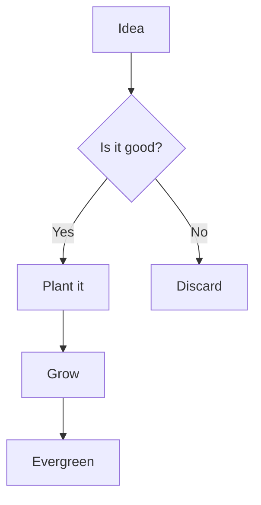

将信息可视化是理解的关键。Amytis 集成了 Mermaid.js 用于绘制图表，并能轻松处理图片。

## Mermaid 图表

你可以直接在 Markdown 中编写图表：

```mermaid
graph TD
    A[Idea] --> B{Is it good?}
    B -- Yes --> C[Plant it]
    B -- No --> D[Discard]
    C --> E[Grow]
    E --> F[Evergreen]
```

## 图片

支持标准的 Markdown 图片语法，包括相对路径：

